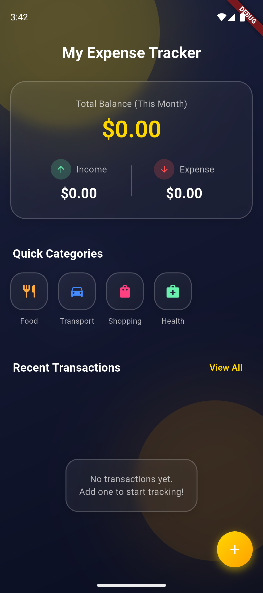
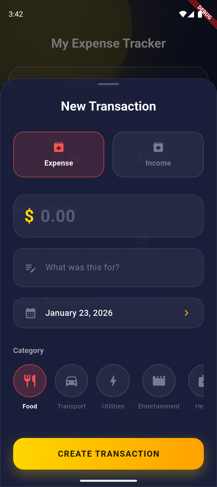

# My Expense Tracker - Premium Expense Tracker

My Expense Tracker is a modern, high-performance expense tracking application built with Flutter. It features a stunning dark-mode aesthetic with gold and amber accents, leveraging glassmorphism and liquid animations for a premium user experience.



## ✨ Features

- **Dynamic Dashboard**: A glassmorphic summary card providing an immediate overview of your monthly balance, income, and expenses.
- **Glassmorphism UI**: Beautifully designed interface using semi-transparent containers, blur effects, and premium color palettes.
- **Quick Category Shortcuts**: Rapidly add transactions using pre-defined categories like Food, Transport, Shopping, and Health.
- **Advanced State Management**: Powered by **Riverpod** with code generation for a reactive and robust architecture.
- **Offline First**: Uses **Hive** for ultra-fast local storage, ensuring your data is always accessible without an internet connection.
- **Intuitive Interactions**:
    - **Swipe-to-Action**: Delete or edit transactions with simple gestures.
    - **Modal Workflows**: Clean and focused add/edit transaction flows.
    - **Haptic-ready UI**: Premium animations and feedback loops.

## 🛠️ Technology Stack

- **Framework**: [Flutter](https://flutter.dev/)
- **State Management**: [Riverpod 2.0](https://riverpod.dev/) (with `@riverpod` annotations)
- **Local Database**: [Hive](https://docs.hivedb.dev/) (NoSQL key-value store)
- **Navigation**: [GoRouter](https://pub.dev/packages/go_router)
- **Data Modeling**: [Freezed](https://pub.dev/packages/freezed) & [JSON Serializable](https://pub.dev/packages/json_serializable)
- **Styling**: Custom Design System with Dark Mode support.

## 🚀 Getting Started

### Prerequisites

- Flutter SDK (latest stable)
- Android Studio / VS Code with Dart & Flutter extensions
- Android Emulator / Physical Device

### Installation & Run

1. **Clone the repository**:
   ```bash
   git clone https://github.com/your-username/expense_tracker_flutter.git
   cd expense_tracker_flutter
   ```

2. **Install dependencies**:
   ```bash
   flutter pub get
   ```

3. **Generate code (Riverpod/Freezed)**:
   ```bash
   flutter pub run build_runner build --delete-conflicting-outputs
   ```

4. **Launch on Emulator**:
   ```bash
   flutter run
   ```

## 📂 Project Structure

- `lib/src/core`: Design system, themes, and shared widgets (GlassContainer, LiquidBackground).
- `lib/src/features/transactions`: Domain logic, data repositories (Hive), and UI for managing expenses.
- `lib/src/features/home`: Dashboard presentation and summary widgets.
- `lib/src/routing`: Navigation configuration using GoRouter.

## 📱 Screenshots

| Home Screen | Add Transaction |
| :--- | :--- |
|  |  |

---
Developed with ❤️ by the Asim.
