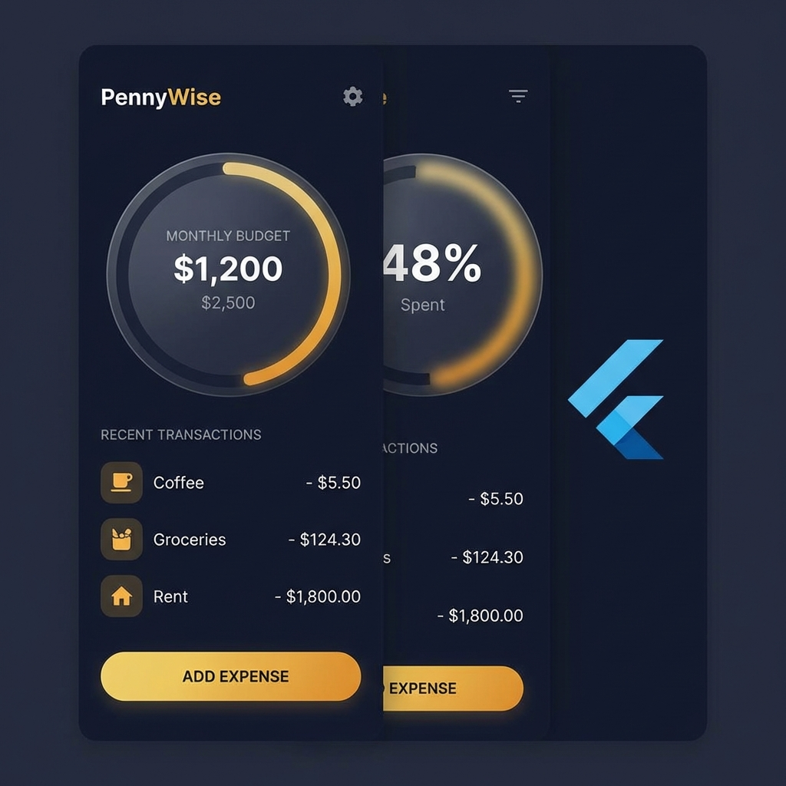

# PennyWise

A premium Expense Tracker application built with Flutter.



## Features

- **Sleek Dashboard**: Overview of your monthly budget and spending.
- **Transaction History**: Track your daily expenses with ease.
- **Budget Management**: Set and monitor your financial goals.
- **Rich UI**: Modern dark mode with gold and amber accents.

## Getting Started

This project is a starting point for a Flutter application.

### Prerequisites

- Flutter SDK
- Dart SDK

### Installation

1.  Clone the repository:
    ```bash
    git clone https://github.com/your-username/expense_tracker_flutter.git
    ```
2.  Install dependencies:
    ```bash
    flutter pub get
    ```
3.  Run the app:
    ```bash
    flutter run
    ```

## Resources

- [Flutter Documentation](https://docs.flutter.dev/)
- [Riverpod Documentation](https://riverpod.dev/)
- [GoRouter Documentation](https://pub.dev/packages/go_router)
